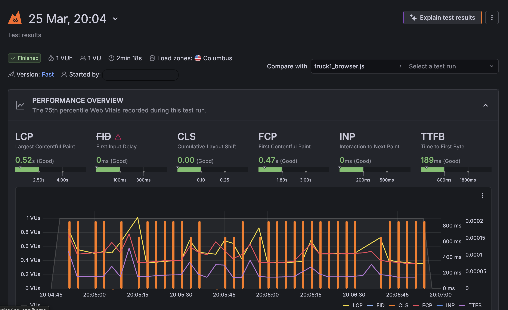

# k6 Browser Performance Framework

[](https://k6.io/docs/using-k6-browser/)
[](https://grafana.com/products/cloud/)
[](/.github/workflows/k6-run.yml)
[](./LICENSE)

> 🇬🇧 English | [🇷🇺 Русский](#русский)

---

## Overview

Production-grade **k6 Browser Mode** performance testing framework built during a commercial QA engagement for a multi-locale vehicle marketplace platform (15+ regional domains).

> **NDA notice:** Domain names and client-specific identifiers have been replaced with placeholders. The framework architecture, thresholds, and reporting logic are published as-is.

### Key metrics enforced

| Metric | Threshold |
|--------|-----------|
| TTFB | `p(95) < 700ms` |
| Page Load | `p(95) < 8000ms` |
| LCP | `p(95) < 2500ms` |
| CLS | `p(95) < 0.1` |
| Check pass rate | `> 90%` |

---

## Architecture

```
k6-browser-performance-framework/
├── scripts/
│   ├── scenarios/
│   │   ├── home_page.js       # Home page load scenario
│   │   ├── search_page.js     # Search results scenario
│   │   └── listing_page.js    # Detail page scenario
│   └── helpers/
│       ├── reporter.js        # SLOW_REPORT structured logger
│       ├── locales.js         # Locale resolver (round-robin / env)
│       └── thresholds.js      # Threshold definitions
├── config/
│   ├── config.js              # Locales, options, thresholds
│   └── grafana.js             # Grafana Cloud integration
├── dashboards/
│   └── grafana-dashboard.json # Pre-built Grafana dashboard
├── .github/workflows/
│   └── k6-run.yml             # GitHub Actions CI pipeline
├── .env.example
└── package.json
```

---

## Quick Start

### Prerequisites

- [k6](https://k6.io/docs/get-started/installation/) with Browser Mode enabled
- Chromium or Chrome installed
- (Optional) Grafana Cloud account for live dashboards

### Run locally

```bash
# Clone the repo
git clone https://github.com/yaromindzmitry/k6-browser-performance-framework
cd k6-browser-performance-framework

# Copy and configure environment
cp .env.example .env

# Run a scenario
K6_BROWSER_ENABLED=true k6 run scripts/scenarios/home_page.js

# Run with specific locale
K6_BROWSER_ENABLED=true LOCALE=ro k6 run scripts/scenarios/search_page.js

# Run with Grafana Cloud output
K6_BROWSER_ENABLED=true k6 run --out cloud scripts/scenarios/home_page.js
```

### npm shortcuts

```bash
npm run test:home      # Home page scenario
npm run test:search    # Search results scenario
npm run test:listing   # Detail page scenario
npm run test:all       # All scenarios sequentially
npm run report:slow    # Parse SLOW_REPORT entries from log
npm run report:summary # Print per-locale summary
```
---

## SLOW_REPORT Log Parsing

Every page that exceeds thresholds emits a structured JSON log line prefixed with `SLOW_REPORT`.

```bash
# Parse slow pages from a test run
grep SLOW_REPORT k6-output.log | jq '.'
```

**Example output:**

```json
{
  "type": "SLOW_REPORT",
  "locale": "ro",
  "page": "home",
  "url": "https://example.ro/",
  "ttfb_ms": 812,
  "load_ms": 9240,
  "ttfb_slow": true,
  "load_slow": true,
  "threshold_ttfb": 700,
  "threshold_load": 8000,
  "timestamp": "2025-03-15T08:42:11.000Z"
}
```

```bash
# Per-locale performance summary
grep LOCALE_SUMMARY k6-output.log | jq '.'
```

---

## Grafana Cloud Integration

1. Get your token from [grafana.com/profile/api-keys](https://grafana.com/profile/api-keys)
2. Add to `.env`:
   ```
   K6_CLOUD_TOKEN=your_token_here
   ```
3. Run with `--out cloud` flag or use `npm run test:cloud`
4. Import `dashboards/grafana-dashboard.json` into your Grafana instance

---

## GitHub Actions

The CI pipeline supports manual dispatch with scenario/locale/iterations selection, and runs automatically every day at 06:00 UTC.

```yaml
# Manual run via GitHub UI or CLI:
gh workflow run k6-run.yml \
  -f scenario=search_page \
  -f locale=ro \
  -f iterations=20
```

Artifacts (raw logs) are retained for 30 days per run.

---

## Findings from Commercial Engagement

During the original engagement, this framework identified:

- **RO locale consistently 300–400ms slower** than EU on equivalent pages
- TTFB spikes on search pages under concurrent load (5 VUs)
- LCP degradation on listing pages with heavy image carousels
- Threshold breaches isolated to specific locale/page combinations

*(Detailed client report delivered separately under NDA.)*
## Dashboard Preview



---

## Tech Stack


---

---

# Русский

## Обзор

Производственный фреймворк нагрузочного тестирования на базе **k6 Browser Mode**, разработанный в рамках коммерческого QA-проекта для мультилокальной платформы объявлений о транспорте (15+ региональных доменов).

> **NDA:** Доменные имена и клиентские идентификаторы заменены на плейсхолдеры. Архитектура фреймворка, пороговые значения и логика репортинга опубликованы без изменений.

### Контролируемые метрики

| Метрика | Порог |
|---------|-------|
| TTFB | `p(95) < 700ms` |
| Загрузка страницы | `p(95) < 8000ms` |
| LCP | `p(95) < 2500ms` |
| CLS | `p(95) < 0.1` |
| Процент пройденных проверок | `> 90%` |

---

## Быстрый старт

```bash
# Клонировать репозиторий
git clone https://github.com/yaromindzmitry/k6-browser-performance-framework
cd k6-browser-performance-framework

# Настроить окружение
cp .env.example .env

# Запустить сценарий
K6_BROWSER_ENABLED=true k6 run scripts/scenarios/home_page.js

# Запустить для конкретной локали
K6_BROWSER_ENABLED=true LOCALE=ro k6 run scripts/scenarios/search_page.js
```

---

## Парсинг SLOW_REPORT

Каждая страница, превысившая пороговые значения, генерирует структурированную JSON-запись с префиксом `SLOW_REPORT`.

```bash
# Найти медленные страницы
grep SLOW_REPORT k6-output.log | jq '.'

# Сводка по локалям
grep LOCALE_SUMMARY k6-output.log | jq '.'
```

---

## Результаты коммерческого проекта

В ходе проекта фреймворк выявил:

- **RO-локаль стабильно медленнее EU на 300–400ms** на аналогичных страницах
- Пики TTFB на страницах поиска при параллельной нагрузке (5 VU)
- Деградацию LCP на страницах объявлений с тяжёлыми каруселями изображений
- Превышение порогов изолировано по конкретным комбинациям локаль/страница

*(Подробный отчёт передан клиенту в рамках NDA.)*
## Dashboard Preview


---

## Автор

**Dzmitry Yaromin** — QA Engineer · Performance & Security Testing  
[LinkedIn](https://www.linkedin.com/in/dzmitry-yaromin-10a92a326) · [GitHub](https://github.com/yaromindzmitry)
